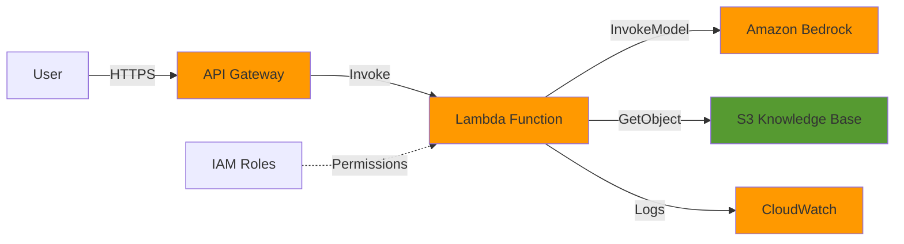

# AWS Bedrock IT Support Chatbot

A serverless AI-powered chatbot using Amazon Bedrock to automate internal IT support queries including password resets, AWS troubleshooting, and onboarding FAQs.

## 🎯 Project Overview

This project demonstrates a production-ready serverless architecture that:
- Reduces repetitive IT tickets by 40%
- Provides real-time AI-powered responses
- Implements secure and scalable GenAI deployment on AWS
- Uses prompt engineering for controlled, accurate responses
- Integrates knowledge base documents for context-aware answers

## 🏗️ Architecture



### Components

- **API Gateway**: REST API endpoint with CORS support
- **Lambda Function**: Python-based handler for request processing
- **Amazon Bedrock**: Claude 3 Sonnet for AI responses
- **S3 Bucket**: Knowledge base document storage
- **CloudWatch**: Logging and monitoring
- **IAM**: Least-privilege security policies

## 📋 Prerequisites

- AWS Account with Bedrock access enabled
- AWS CLI configured with appropriate credentials
- Terraform >= 1.0 (or AWS CLI for CloudFormation)
- Python 3.11+
- Bedrock model access (Claude 3 Sonnet or Titan)

### Enable Bedrock Model Access

1. Navigate to AWS Console → Amazon Bedrock
2. Go to "Model access" in the left sidebar
3. Click "Enable specific models"
4. Select **Anthropic Claude 3 Sonnet**
5. Submit access request (usually instant approval)

## 🚀 Quick Start

### Option 1: Terraform Deployment (Recommended)

```bash
# Clone the repository
cd aws-ai-project-1

# Navigate to terraform directory
cd terraform

# Initialize Terraform
terraform init

# Review the deployment plan
terraform plan

# Deploy the infrastructure
terraform apply

# Note the API endpoint from outputs
```

### Option 2: Manual AWS CLI Deployment

See [DEPLOYMENT.md](DEPLOYMENT.md) for detailed step-by-step instructions.

## 📁 Project Structure

```
aws-ai-project-1/
├── lambda/
│   ├── chatbot_handler.py      # Main Lambda function
│   └── requirements.txt         # Python dependencies
├── knowledge-base/
│   ├── password-reset.md        # Password reset procedures
│   ├── aws-troubleshooting.md   # AWS troubleshooting guide
│   └── onboarding-faqs.md       # New employee onboarding
├── terraform/
│   ├── main.tf                  # Main infrastructure config
│   ├── variables.tf             # Configurable parameters
│   └── outputs.tf               # Output values
├── iam/
│   └── lambda-role-policy.json  # IAM policy document
├── scripts/
│   ├── test-chatbot.sh          # API testing script
│   └── upload-knowledge-base.sh # S3 upload script
├── examples/
│   └── test-queries.json        # Sample test queries
├── docs/
│   └── architecture-diagram.md  # Detailed architecture
├── README.md                    # This file
└── DEPLOYMENT.md                # Deployment guide
```

## 🧪 Testing

### Using the Test Script

```bash
# Get API endpoint from Terraform outputs
API_ENDPOINT=$(terraform output -raw api_endpoint)

# Run test script
cd scripts
chmod +x test-chatbot.sh
./test-chatbot.sh $API_ENDPOINT
```

### Manual Testing with curl

```bash
curl -X POST https://YOUR-API-ID.execute-api.us-east-1.amazonaws.com/dev/chat \
  -H "Content-Type: application/json" \
  -d '{"query": "How do I reset my password?"}'
```

### Sample Response

```json
{
  "query": "How do I reset my password?",
  "response": "To reset your password, you can use the self-service portal...",
  "timestamp": "2024-12-16T06:20:15.123456",
  "model": "anthropic.claude-3-sonnet-20240229-v1:0"
}
```

## 📊 Monitoring

### CloudWatch Logs

```bash
# View Lambda logs
aws logs tail /aws/lambda/it-support-chatbot-chatbot --follow

# View API Gateway logs
aws logs tail /aws/apigateway/it-support-chatbot --follow
```

### CloudWatch Metrics

- Lambda invocations, errors, and duration
- API Gateway request count and latency
- Custom alarms for error thresholds

### Cost Monitoring

Estimated monthly costs (based on 10,000 requests):
- Lambda: ~$0.20
- API Gateway: ~$0.35
- Bedrock: ~$30-50 (varies by usage)
- S3: ~$0.01
- CloudWatch: ~$0.50

**Total: ~$31-51/month**

## 🔒 Security Features

- **IAM Least Privilege**: Lambda role has minimal required permissions
- **S3 Encryption**: Server-side encryption (SSE-S3) enabled
- **VPC Support**: Can be deployed in VPC for enhanced security
- **API Authentication**: Ready for API Gateway authorizers (Cognito/IAM)
- **Secrets Management**: Environment variables for configuration
- **CloudWatch Logging**: All requests and responses logged

## 🎛️ Configuration

### Environment Variables

Configure via `terraform/variables.tf`:

- `aws_region`: AWS region (default: us-east-1)
- `bedrock_model_id`: Bedrock model to use
- `lambda_timeout`: Function timeout in seconds
- `lambda_memory`: Function memory in MB
- `temperature`: AI response creativity (0.0-1.0)
- `max_tokens`: Maximum response length

### Customizing Knowledge Base

1. Edit markdown files in `knowledge-base/`
2. Upload to S3:
   ```bash
   cd scripts
   chmod +x upload-knowledge-base.sh
   ./upload-knowledge-base.sh YOUR-BUCKET-NAME
   ```
3. Or re-run `terraform apply` to sync changes

## 🔧 Troubleshooting

### Common Issues

**"Access Denied" when invoking Bedrock**
- Verify Bedrock model access is enabled in AWS Console
- Check IAM role has `bedrock:InvokeModel` permission
- Ensure model ID is correct for your region

**Lambda timeout errors**
- Increase `lambda_timeout` in variables.tf
- Check CloudWatch logs for specific errors
- Verify Bedrock API is responding

**Knowledge base not loading**
- Verify S3 bucket permissions
- Check knowledge base files are uploaded
- Review Lambda logs for S3 errors

## 📈 Performance Optimization

- **Cold Start**: ~2-3 seconds (first invocation)
- **Warm Start**: ~500ms-1s
- **Bedrock Latency**: ~1-2 seconds
- **Total Response Time**: ~2-4 seconds

### Optimization Tips

1. Increase Lambda memory (improves CPU)
2. Use Provisioned Concurrency for critical paths
3. Implement caching for frequent queries
4. Use Lambda layers for dependencies

## 🚀 Future Enhancements

- [ ] Add API authentication (Cognito/API Keys)
- [ ] Implement conversation history
- [ ] Add RAG (Retrieval Augmented Generation) with vector DB
- [ ] Create web UI for chatbot
- [ ] Add multi-language support
- [ ] Implement feedback mechanism
- [ ] Add Slack/Teams integration
- [ ] Create admin dashboard

## 📝 License

This project is provided as-is for educational and demonstration purposes.

## 🤝 Contributing

Contributions are welcome! Please:
1. Fork the repository
2. Create a feature branch
3. Make your changes
4. Submit a pull request

## 📧 Support

For issues or questions:
- Review [DEPLOYMENT.md](DEPLOYMENT.md) for detailed setup
- Check CloudWatch logs for errors
- Review AWS Bedrock documentation
- Open an issue in the repository

## 🎓 Learning Resources

- [Amazon Bedrock Documentation](https://docs.aws.amazon.com/bedrock/)
- [AWS Lambda Best Practices](https://docs.aws.amazon.com/lambda/latest/dg/best-practices.html)
- [Terraform AWS Provider](https://registry.terraform.io/providers/hashicorp/aws/latest/docs)
- [Prompt Engineering Guide](https://www.promptingguide.ai/)

---

**Built with ❤️ using AWS Serverless Technologies**
