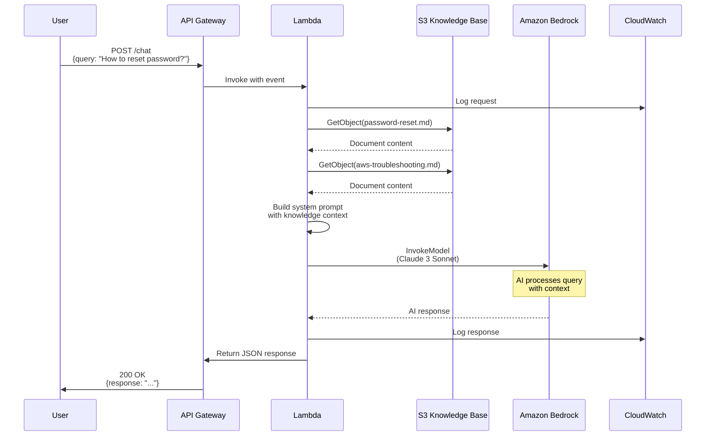
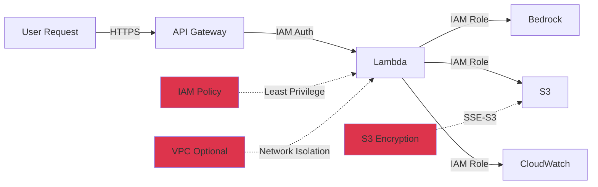

# Architecture Overview

## System Architecture

```mermaid
graph TB
    subgraph "Client Layer"
        A[User/Client]
    end
    
    subgraph "AWS Cloud"
        subgraph "API Layer"
            B[API Gateway<br/>REST API]
            B1[CORS Config]
            B2[/chat endpoint]
        end
        
        subgraph "Compute Layer"
            C[Lambda Function<br/>Python 3.11]
            C1[Bedrock Client]
            C2[S3 Client]
            C3[Request Handler]
        end
        
        subgraph "AI Layer"
            D[Amazon Bedrock<br/>Claude 3 Sonnet]
        end
        
        subgraph "Storage Layer"
            E[S3 Bucket<br/>Knowledge Base]
            E1[password-reset.md]
            E2[aws-troubleshooting.md]
            E3[onboarding-faqs.md]
        end
        
        subgraph "Security Layer"
            F[IAM Role]
            F1[Bedrock Policy]
            F2[S3 Policy]
            F3[CloudWatch Policy]
        end
        
        subgraph "Monitoring Layer"
            G[CloudWatch]
            G1[Lambda Logs]
            G2[API Gateway Logs]
            G3[Metrics & Alarms]
        end
    end
    
    A -->|HTTPS POST| B
    B --> B1
    B --> B2
    B2 -->|Invoke| C
    C --> C1
    C --> C2
    C --> C3
    C1 -->|InvokeModel| D
    C2 -->|GetObject| E
    E --> E1
    E --> E2
    E --> E3
    F --> F1
    F --> F2
    F --> F3
    F1 -.->|Authorize| C1
    F2 -.->|Authorize| C2
    F3 -.->|Authorize| G
    C -->|Write Logs| G
    B -->|Write Logs| G
    G --> G1
    G --> G2
    G --> G3
    D -->|AI Response| C
    E -->|Context| C
    C -->|JSON Response| B
    B -->|HTTPS| A
    
    style D fill:#FF9900,stroke:#232F3E,stroke-width:2px
    style E fill:#569A31,stroke:#232F3E,stroke-width:2px
    style C fill:#FF9900,stroke:#232F3E,stroke-width:2px
    style B fill:#FF9900,stroke:#232F3E,stroke-width:2px
    style G fill:#FF9900,stroke:#232F3E,stroke-width:2px
    style F fill:#DD344C,stroke:#232F3E,stroke-width:2px
```

## Request Flow



## Component Details

### API Gateway

**Purpose**: HTTP endpoint for client requests

**Configuration**:
- Type: REST API
- Endpoint: Regional
- CORS: Enabled (all origins)
- Methods: POST, OPTIONS
- Integration: Lambda Proxy

**Security**:
- Currently: Open (for testing)
- Production: Add API Keys or Cognito

### Lambda Function

**Purpose**: Request processing and orchestration

**Runtime**: Python 3.11

**Key Functions**:
1. `lambda_handler()` - Main entry point
2. `get_knowledge_context()` - Retrieves relevant docs from S3
3. `invoke_bedrock()` - Calls Bedrock API

**Environment Variables**:
- `BEDROCK_MODEL_ID`: Model identifier
- `KNOWLEDGE_BASE_BUCKET`: S3 bucket name
- `MAX_TOKENS`: Response length limit
- `TEMPERATURE`: AI creativity level

**Resource Limits**:
- Memory: 512 MB (configurable)
- Timeout: 60 seconds (configurable)
- Concurrent executions: 1000 (AWS default)

### Amazon Bedrock

**Purpose**: AI-powered response generation

**Model**: Anthropic Claude 3 Sonnet

**Features**:
- Natural language understanding
- Context-aware responses
- Prompt engineering support
- Safety guardrails

**API Call**:
```python
bedrock_runtime.invoke_model(
    modelId='anthropic.claude-3-sonnet-20240229-v1:0',
    body=json.dumps({
        'anthropic_version': 'bedrock-2023-05-31',
        'max_tokens': 2048,
        'temperature': 0.7,
        'system': system_prompt,
        'messages': [{'role': 'user', 'content': query}]
    })
)
```

### S3 Knowledge Base

**Purpose**: Store IT support documentation

**Structure**:
```
s3://bucket-name/
├── password-reset.md
├── aws-troubleshooting.md
└── onboarding-faqs.md
```

**Features**:
- Versioning enabled
- Server-side encryption (SSE-S3)
- Public access blocked
- Lifecycle policies (optional)

### IAM Security

**Principle**: Least privilege access

**Lambda Execution Role Policies**:

1. **Bedrock Access**:
   ```json
   {
     "Effect": "Allow",
     "Action": ["bedrock:InvokeModel"],
     "Resource": "arn:aws:bedrock:*:*:foundation-model/anthropic.claude-3-sonnet-*"
   }
   ```

2. **S3 Access**:
   ```json
   {
     "Effect": "Allow",
     "Action": ["s3:GetObject", "s3:ListBucket"],
     "Resource": ["arn:aws:s3:::bucket-name", "arn:aws:s3:::bucket-name/*"]
   }
   ```

3. **CloudWatch Logs**:
   - Managed policy: `AWSLambdaBasicExecutionRole`

### CloudWatch Monitoring

**Log Groups**:
- `/aws/lambda/it-support-chatbot-chatbot`
- `/aws/apigateway/it-support-chatbot`

**Metrics Tracked**:
- Lambda invocations
- Lambda errors
- Lambda duration
- API Gateway requests
- API Gateway latency
- Bedrock API calls

**Alarms**:
- Lambda errors > 5 in 5 minutes
- Lambda duration > 10 seconds average

## Data Flow

### Request Processing

1. **Client sends query** → API Gateway
2. **API Gateway validates** → Invokes Lambda
3. **Lambda extracts query** → Logs to CloudWatch
4. **Lambda retrieves context** → S3 GetObject
5. **Lambda builds prompt** → System + User query + Context
6. **Lambda invokes Bedrock** → AI generates response
7. **Lambda formats response** → JSON with metadata
8. **Lambda returns** → API Gateway
9. **API Gateway responds** → Client receives answer

### Knowledge Base Retrieval Logic

```python
# Keyword matching
if 'password' in query:
    fetch('password-reset.md')
if 'aws' in query:
    fetch('aws-troubleshooting.md')
if 'onboard' in query:
    fetch('onboarding-faqs.md')
```

**Future Enhancement**: Use vector embeddings for semantic search

## Scalability

### Auto-scaling

- **Lambda**: Automatic (up to 1000 concurrent)
- **API Gateway**: Unlimited requests
- **Bedrock**: Managed by AWS
- **S3**: Unlimited storage

### Performance Characteristics

| Metric | Value |
|--------|-------|
| Cold start | 2-3 seconds |
| Warm start | 500ms-1s |
| Bedrock latency | 1-2 seconds |
| S3 retrieval | 50-200ms |
| Total response time | 2-4 seconds |

### Cost Scaling

| Requests/Month | Estimated Cost |
|----------------|----------------|
| 1,000 | ~$3-5 |
| 10,000 | ~$31-51 |
| 100,000 | ~$300-500 |
| 1,000,000 | ~$3,000-5,000 |

*Bedrock is the primary cost driver*

## Security Architecture



### Security Layers

1. **Transport**: HTTPS only
2. **Authentication**: IAM roles (no credentials in code)
3. **Authorization**: Least privilege policies
4. **Encryption**: S3 server-side encryption
5. **Logging**: All requests logged to CloudWatch
6. **Network**: Optional VPC deployment

## Monitoring Dashboard

### Key Metrics to Watch

1. **Availability**
   - API Gateway 5xx errors
   - Lambda errors
   - Bedrock throttling

2. **Performance**
   - Lambda duration
   - API latency
   - Cold start frequency

3. **Cost**
   - Bedrock token usage
   - Lambda invocations
   - Data transfer

4. **Usage**
   - Requests per hour
   - Unique users (if tracked)
   - Popular queries

## Future Architecture Enhancements

1. **Conversation History**
   - Add DynamoDB for session storage
   - Track multi-turn conversations

2. **Vector Search**
   - Use Amazon OpenSearch
   - Semantic similarity matching
   - Better knowledge retrieval

3. **Caching Layer**
   - ElastiCache for frequent queries
   - Reduce Bedrock costs

4. **Multi-Region**
   - Deploy to multiple regions
   - Route 53 for failover
   - Global low latency

5. **Web UI**
   - S3 + CloudFront static hosting
   - React/Vue frontend
   - WebSocket for real-time chat

---

**This architecture provides a scalable, secure, and cost-effective solution for AI-powered IT support.**
